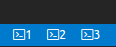

# terminal-tabs

**Warning: This is an early release that is not thoroughly tested.**

Adds tabs for each terminal process to the status bar.

This extension provides the following commands that can be keybound in your [keybindings.json](https://code.visualstudio.com/docs/customization/keybindings#_customizing-shortcuts) file:

- `terminalTabs.createTerminal`: Creates a terminal with an icon
- `terminalTabs.createNamedTerminal`: Creates a terminal with an icon that has a name (indicated in the dropdown)
- `terminalTabs.showTerminal1`: Shows the first terminal
- `terminalTabs.showTerminal2`: Shows the second terminal
- `terminalTabs.showTerminal3`: Shows the third terminal
- `terminalTabs.showTerminal4`: Shows the fourth terminal
- `terminalTabs.showTerminal5`: Shows the fifth terminal
- `terminalTabs.showTerminal6`: Shows the sixth terminal
- `terminalTabs.showTerminal7`: Shows the seventh terminal
- `terminalTabs.showTerminal8`: Shows the eighth terminal
- `terminalTabs.showTerminal9`: Shows the ninth terminal
- `terminalTabs.showTerminal10`: Shows the tenth terminal

## Limitations

- The terminals can only be tracked when they are created by the terminal API (See [Microsoft/vscode#13267](https://github.com/Microsoft/vscode/issues/13267)). It is currently not possible to intercept creation of the terminal panel on restart for example.
